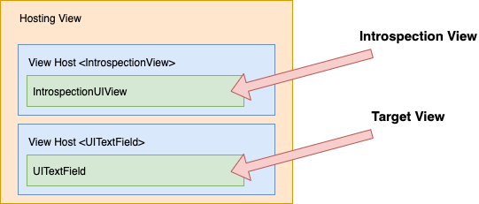

Introspect for SwiftUI
======================

[![CircleCI_Status]][CircleCI_URL]&nbsp;&nbsp;[![GithubCI_Status]][GithubCI_URL] [![Siteline_Badge]](https://siteline.com) [![Quintschaf_Badge]](https://quintschaf.com)

> Introspect allows you to get the underlying UIKit or AppKit element of a SwiftUI view.

For instance, with Introspect you can access `UITableView` to modify separators, or `UINavigationController` to customize the tab bar.

How it works
------------

Introspect works by adding a custom `IntrospectionView` to the view hierarchy, then looking into the UIKit hierarchy to find the relevant view.



For instance, when introspecting a `TextField`, it will:

 - Add `IntrospectionView` as an overlay of `TextField`
 - Get the view host of the introspection view (which is alongside the view host of the `UITextField`)
 - Get the previous sibling containing `UITextField`

**Please note that this introspection method might break in future SwiftUI releases.** Future implementations might not use the same hierarchy, or might not use UIKit elements that are being looked for. Though the library is unlikely to crash, the `.introspect()` method will not be called in those cases.

### Usage in production

`Introspect` is meant to be used in production. It does not use any private API. It only inspects the view hierarchy using publicly available methods. The library takes a defensive approach to inspecting the view hierarchy: there is no hard assumption that elements are laid out a certain way, there is no force-cast to UIKit classes, and the `introspect()` methods are simply ignored if UIKit views cannot be found.


Install
-------

### SwiftPM

```
https://github.com/siteline/SwiftUI-Introspect.git
```

### Cocoapods

```
pod 'Introspect'
```

Introspection
-------------

### Implemented

SwiftUI | UIKit | AppKit | Introspect
--- | --- | --- | ---
NavigationView (StackNavigationViewStyle) | UINavigationController | _N/A_ | `.introspectNavigationController()`
NavigationView (DoubleColumnNavigationViewStyle) | UISplitViewController | _N/A_ | `.introspectSplitViewController()`
_Any embedded view_ | UIViewController | _N/A_ | `.introspectViewController()`
ScrollView | UIScrollView | NSScrollView | `.introspectScrollView()`
List | UITableView | NSTableView | `.introspectTableView()`
View in List | UITableViewCell | NSTableCellView | `introspectTableViewCell()`
TabView | UITabBarController | NSTabView | `.introspectTabBarController()` (iOS) <br/> `.introspectTabView()` (macOS)
TextField | UITextField | NSTextField | `.introspectTextField()`
Toggle | UISwitch | NSButton | `.introspectSwitch()` (iOS) <br/> `.introspectButton()` (macOS)
Slider | UISlider | NSSlider | `.introspectSlider()`
Stepper | UIStepper | NSStepper | `.introspectStepper()`
DatePicker | UIDatePicker | NSDatePicker | `.introspectDatePicker()`
Picker (SegmentedPickerStyle) | UISegmentedControl | NSSegmentedControl | `.introspectSegmentedControl()`
Button | _N/A_ | NSButton | `.introspectButton()`
ColorPicker | UIColorWell | NSColorWell | `.introspectColorWell()`
TextEditor | UITextView | NSTextView | `.introspectTextView()`


**Missing an element?** Please [create an issue](https://github.com/timbersoftware/SwiftUI-Introspect/issues). As a temporary solution, you can [implement your own selector](#implement-your-own-selector).

### Cannot implement

SwiftUI | Affected Frameworks | Why
--- | --- | ---
Text | UIKit, AppKit | Not a UILabel / NSLabel
Image | UIKit, AppKit | Not a UIImageView / NSImageView
Button | UIKit | Not a UIButton

Examples
--------

### List

```swift
List {
    Text("Item 1")
    Text("Item 2")
}
.introspectTableView { tableView in
    tableView.separatorStyle = .none
}
.introspectTableViewCell { cell in
    let backgroundView = UIView()
    backgroundView.backgroundColor = .clear
    cell.selectedBackgroundView = backgroundView
}
```

### ScrollView

```swift
ScrollView {
    Text("Item 2")
}
.introspectScrollView { scrollView in
    scrollView.refreshControl = UIRefreshControl()
}
```

### NavigationView

```swift
NavigationView {
    Text("Item 2")
    .introspectNavigationController { navigationController in
        navigationController.navigationBar.backgroundColor = .red
    }
}
```

### TextField

```swift
TextField("Text Field", text: $textFieldValue)
.introspectTextField { textField in
    textField.layer.backgroundColor = UIColor.red.cgColor
}
```

Implement your own selector
---------------------------

**Missing an element?** Please [create an issue](https://github.com/timbersoftware/SwiftUI-Introspect/issues).

In case Introspect doesn't support the SwiftUI element that you're looking for, you can implement your own selector. For example, to look for a `UITextField`:

```swift
extension View {
    public func introspectTextField(customize: @escaping (UITextField) -> ()) -> some View {
        return inject(UIKitIntrospectionView(
            selector: { introspectionView in
                guard let viewHost = Introspect.findViewHost(from: introspectionView) else {
                    return nil
                }
                return Introspect.previousSibling(containing: UITextField.self, from: viewHost)
            },
            customize: customize
        ))
    }
}
```

You can use any of the following [methods](https://github.com/timbersoftware/SwiftUI-Introspect/blob/master/Introspect/Introspect.swift#L3-L71) to inspect the hierarchy:

 - `Introspect.findChild(ofType:in:)`
 - `Introspect.findChildUsingFrame(ofType:in:from:)`
 - `Introspect.previousSibling(containing:from:)`
 - `Introspect.nextSibling(containing:from:)`
 - `Introspect.findAncestor(ofType:from:)`
 - `Introspect.findHostingView(from:)`
 - `Introspect.findViewHost(from:)`

Releasing
---------

 - Increment version number:

```
$ bundle exec fastlane run increment_version_number bump_type:minor # major|minor|patch
```

 - Update changelog with new version
 - Bump version in `Introspect.podspec`
 - Commit and push changes
 - Tag new version:

```
$ git tag -a <VERSION> -m "<MESSAGE>"
$ git push origin --tags
```

 - Push to cocoapods trunk:

```
$ bundle exec pod trunk push .
```


<!-- References -->
[CircleCI_Status]: https://circleci.com/gh/siteline/SwiftUI-Introspect.svg?style=svg&circle-token=6f995f204d4d417d31f79e7257f6e1ecf430ae07

[CircleCI_URL]: https://circleci.com/gh/siteline/SwiftUI-Introspect

[GithubCI_Status]: https://github.com/siteline/swiftui-introspect/actions/workflows/build-and-test.yml/badge.svg?branch=master

[GithubCI_URL]: https://github.com/siteline/SwiftUI-Introspect/actions/workflows/build-and-test.yml

[Siteline_Badge]: https://badgen.net/badge/Built%20by/Siteline/blue?icon=https://uploads-ssl.webflow.com/5f4513afbbfc64c4777fcccf/5f525b122370d681879e170e_siteline-icon.svg

[Quintschaf_Badge]: https://badgen.net/badge/Maintained%20by/Quintschaf/cyan?icon=https://quintschaf.com/assets/logo.svg
